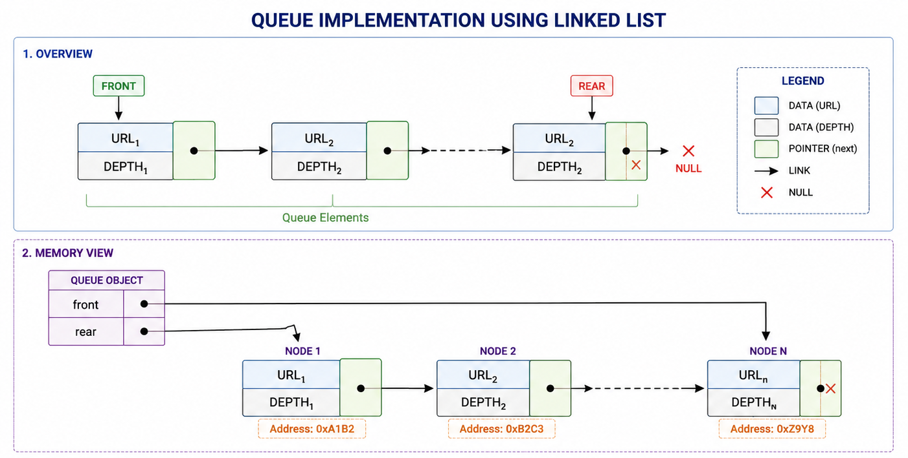

# Web Crawler Design Proposal - Version 3

## Overview

The Web Crawler recursively visits web pages starting from a seed URL, renders and downloads their HTML content, extracts hyperlinks, and stores each downloaded page for future processing.

The crawler is implemented in C++ using custom data structures such as `Queue`, `HashMap`, and `DynamicArray`. Modern web pages are rendered using **Chrome DevTools Protocol (CDP)**, allowing the crawler to process both static and JavaScript-based websites.

---

## Architecture - Web crawler


# Section 1 - Public API

The crawler is organized into independent modules, where each component is responsible for a specific task in the crawling pipeline. This modular architecture improves maintainability, simplifies testing, and allows future enhancements without affecting the overall system.

---

## Crawler

```cpp
class Crawler{
private:
    int depth;
    void loop(std::string url,
              std::string seedHtml,
              int seedId);

    Set<std::string> visited;
    Frontier frontier;
    Normalizer normalizer;
    CDPScraper fetch;
    HtmlParser htmlparser;
    PageStorage pages;

public:
    Crawler();
    void Continue();
    void crawl(std::string seed, int deep);
};
```

The `Crawler` class coordinates the complete crawling process. It downloads webpages, normalizes URLs, extracts hyperlinks, manages the crawling frontier, stores downloaded pages in the database, and maintains a visited set to avoid duplicate crawling. It also supports resuming interrupted crawling sessions through the `Continue()` function.

---

## Frontier

```cpp
class Frontier{

    struct URL{
        std::string link;
        int depth;
    };

    std::string getDate();
    Queue<URL> queue;
    PageStorage pages;

public:
    void put(std::string& link,
             int depth,
             int max,
             int seedId);

    size_t putSeed(std::string& link,
                   std::string& html,
                   int max,
                   int depth = 0);

    URL pop();
    bool empty();
    std::string getLink();
    int getDepth();
    size_t getSize();
    void backup();
};
```

The `Frontier` maintains URLs waiting to be crawled using a FIFO queue. Along with the in-memory queue, it stores pending URLs in the database, enabling the crawler to recover its state after interruption. The `backup()` function reconstructs the queue from the database during crawl continuation.

---

## Downloader

```cpp
class CDPScraper{
public:
    std::string getHtml(std::string url);
};
```

The downloader uses the **Chrome DevTools Protocol (CDP)** to launch a headless Chrome instance, render JavaScript-driven webpages, and return the fully rendered HTML document.

---

## HtmlParser

```cpp
class HtmlParser{
private:
    DynamicArray<std::string> links;

public:
    size_t parseHttp(const std::string& html,
                     size_t start);

    size_t parseHref(const std::string& html,
                     size_t start);

    DynamicArray<std::string> parseHtml(
        const std::string& html);
};
```

The `HtmlParser` extracts hyperlinks from rendered HTML documents. It scans the HTML content, identifies supported URLs, and returns all discovered hyperlinks for further processing.

---

## Normalizer

```cpp
class Normalizer{

private:
    std::string read(std::string page);
    void To_lower(std::string& link);
    void removeFragment(std::string& link);
    void normalizePath(std::string& link);
    void relativeURL(std::string& link);

public:
    Set<std::string> ignoreExtension;
    Set<std::string> ignoreDomain;
    std::string seedLink;

    Normalizer();

    bool isrelative(std::string& source);

    void normalize(std::string& link);

    DynamicArray<std::string> normalize(
        DynamicArray<std::string>& links);
};
```

The `Normalizer` converts URLs into a consistent canonical representation. It resolves relative URLs, removes fragments, converts URLs to lowercase where appropriate, normalizes paths, and filters unwanted domains and file extensions. This minimizes duplicate crawling caused by different textual representations of the same webpage.

---

## PageStorage

```cpp
class PageStorage{

private:
    MYSQL* conn;

public:
    PageStorage();
    ~PageStorage();

    // Pages
    bool storePage(std::string& url,
                   std::string& html,
                   int depth,
                   int seedId);

    bool getPage(const std::string& url,
                 int& depth,
                 std::string& html,
                 std::string& lastCrawl);

    std::string getHtml(std::string& url);
    int getDepth(std::string& url);
    std::string getLastCrawl(std::string& url);

    // Frontier
    bool putFrontier(std::string url,
                     int depth,
                     int maxDepth,
                     int seedId);

    bool deleteFrontier(std::string url,
                        int depth);

    void getFrontier(std::string& url,
                     int& depth);

    bool clearFrontier();

    std::string getLastFrontier(std::string& url,
                                int& depth,
                                int& seedId,
                                int& maxDepth);

    // Seeds
    size_t putSeeds(std::string& url,
                    std::string& html,
                    int& depth,
                    int& maxDepth);
};
```

`PageStorage` provides persistent storage using **MySQL**. It manages three database tables:

* **Pages** – Stores downloaded webpages along with their HTML, depth, and associated Seed ID.
* **Frontier** – Stores pending URLs so crawling can resume after interruption.
* **Seeds** – Stores seed URLs and their crawl metadata, including the maximum crawl depth.

The class also provides APIs for inserting, retrieving, updating, and restoring crawler state from the database.

---

## Queue

```cpp
template<typename T>
class Queue{

private:
    LinkedList<T> queue;

public:
    void push(T value);
    T pop();
    T front();
    bool empty();
    size_t size();
};
```

The `Queue` is a custom FIFO container implemented using the custom `LinkedList`. It is used by the `Frontier` to maintain the order in which URLs are processed.

---

## Set

```cpp
template<typename T>
class Set{

private:
    HashMap<T, bool> map;

public:
    void insert(T value);
    bool exists(T value);
    void remove(T value);
    size_t size();
    DynamicArray<T> getAll();
    void clear();
};
```

The `Set` is implemented using the custom `HashMap` and provides constant-time average lookup for visited URLs. It prevents duplicate crawling by ensuring that each normalized URL is processed only once.

---

# Design Justification

The crawler follows a modular architecture in which every component has a clearly defined responsibility.

* `Crawler` coordinates the overall crawling workflow.
* `CDPScraper` downloads fully rendered webpages using Chrome DevTools Protocol.
* `HtmlParser` extracts hyperlinks from rendered HTML.
* `Normalizer` converts URLs into a canonical form and filters unsupported links.
* `Frontier` manages pending crawl tasks while providing persistent recovery support.
* `PageStorage` maintains persistent crawler state using MySQL.
* `Queue` manages URL processing order.
* `Set` prevents duplicate crawling using a hash-based lookup structure.

Separating these responsibilities improves readability, testing, maintainability, and future extensibility. Features such as persistent crawl continuation, alternate storage backends, or different rendering engines can be introduced with minimal impact on the remaining modules.

---

# Section 2 - Internal Representation

## Frontier

Uses a custom Queue.



The queue stores URLs in FIFO order.

---

## Downloader

Uses **Chrome DevTools Protocol (CDP)** to communicate with a headless Chrome browser.


This enables crawling of JavaScript-heavy websites where the original HTTP response does not contain the complete page content.

---

## Visited URL Store

Uses a custom HashMap.


The HashMap provides fast duplicate detection before downloading a page.

---

## Page Storage

Uses an **MySQL** database for persistent storage.

Each database record contains:

- URL
- Rendered HTML
- Crawling Depth

MtSQL preserves downloaded pages across multiple executions and provides efficient retrieval based on the stored URL.

---

# Section 3 - Failure Handling

## Invalid URL

Invalid URLs are skipped and the crawler continues processing the remaining URLs.

---

## Duplicate URL

Before downloading a page, the crawler checks the HashMap. Already visited URLs are ignored.

---

## Browser Launch Failure

If Chrome cannot be launched or a CDP connection cannot be established, the crawler reports the error and continues crawling.

---

## Page Rendering Timeout

If page rendering exceeds the timeout limit, the page is skipped and crawling continues.

---

## Malformed HTML

The parser extracts all valid hyperlinks that can be identified. Invalid HTML is ignored without terminating the crawler.

---

## Empty Page

Empty HTML documents are stored successfully, although no hyperlinks are extracted.

---

# Section 4 - Complexity Analysis

## Frontier

Implemented using a custom **Queue**.

| Operation | Best | Average | Worst | Reason |
|-----------|:----:|:-------:|:-----:|--------|
| `push()` | O(1) | O(1) | O(1) | Inserts a URL at the rear of the queue. |
| `pop()` | O(1) | O(1) | O(1) | Removes the URL from the front of the queue. |
| `front()` | O(1) | O(1) | O(1) | Returns the front URL without removing it. |
| `empty()` | O(1) | O(1) | O(1) | Checks whether the frontier is empty. |
| `size()` | O(1) | O(1) | O(1) | Returns the maintained queue size. |

---

## Downloader (Chrome DevTools Protocol)

| Operation | Best | Average | Worst | Reason |
|-----------|:----:|:-------:|:-----:|--------|
| `fetchPage()` | O(n) | O(n) | O(n) | Time depends on downloading and rendering the HTML document, where *n* is the size of the rendered HTML. |

---

## HTML Parser

| Operation | Best | Average | Worst | Reason |
|-----------|:----:|:-------:|:-----:|--------|
| `parseHtml()` | O(n) | O(n) | O(n) | Performs a single linear scan of the rendered HTML document to extract hyperlinks. |

---

## URL Normalizer

| Operation | Best | Average | Worst | Reason |
|-----------|:----:|:-------:|:-----:|--------|
| `normalize()` | O(m) | O(m) | O(m) | Processes each URL by removing fragments, resolving paths, checking ignored domains/extensions, and normalizing the URL. **Here *m* is the length of the URL.** |

---

## Visited URL Store

Implemented using a custom **HashMap**.

| Operation | Best | Average | Worst | Reason |
|-----------|:----:|:-------:|:-----:|--------|
| `exists()` | O(1) | O(1) | O(n) | Average constant-time lookup; excessive collisions degrade performance. |
| `insert()` | O(1) | O(1) | O(n) | Rehashing or heavy collisions may increase runtime. |

---

## Page Storage (MySQL)

| Operation | Best | Average | Worst | Reason |
|-----------|:----:|:-------:|:-----:|--------|
| `storePage()` | O(log n) | O(log n) | O(n) | Inserts a crawled page into the MySQL database using the indexed URL field. |
| `getPage()` | O(log n) | O(log n) | O(n) | Retrieves the stored HTML corresponding to a URL. |
| `getDepth()` | O(log n) | O(log n) | O(n) | Retrieves the crawl depth for a stored page. |
| `getLastCrawl()` | O(log n) | O(log n) | O(n) | Retrieves the last crawl timestamp associated with a URL. |
| `hasPage()` | O(log n) | O(log n) | O(n) | Checks whether a page corresponding to the given URL exists in the database. |

---

## Overall Crawling

For each webpage, the crawler performs:

1. Download and render the webpage using Chrome DevTools Protocol.
2. Parse the rendered HTML to extract hyperlinks.
3. Normalize every extracted URL.
4. Check for duplicates using the visited URL store.
5. Store the crawled page in the MySQL database.

If a webpage contains **k** hyperlinks and the rendered HTML size is **n**, the overall processing time for one page is approximately:

\[
O(n + k)
\]

where:

- **n** = size of the rendered HTML document.
- **k** = number of hyperlinks extracted from that document.

---

# Section 5 - Future Compatibility

The crawler is designed using a modular architecture in which each component has a clearly defined responsibility. Crawling, URL normalization, HTML parsing, frontier management, and persistent storage are implemented as independent modules. This separation makes the system easier to extend, maintain, and integrate with future components.

The **PageStorage** module serves as the persistence layer of the crawler. Instead of storing only downloaded pages, it maintains the complete crawler state in a **MySQL** database. The database currently consists of three logical tables:

* **Seeds** – Stores the seed URL, maximum crawl depth, rendered HTML, and crawl metadata.
* **Pages** – Stores every crawled webpage along with its rendered HTML, crawl depth, last crawl date, and the associated Seed ID.
* **Frontier** – Stores pending URLs that have not yet been processed, allowing interrupted crawls to resume without losing progress.

Since the crawler interacts only through the `PageStorage` interface, the underlying storage implementation can be replaced without affecting the remaining modules.

The current `PageStorage` interface is shown below.

```cpp
// Pages
bool storePage(std::string &url,
               std::string &html,
               int depth,
               int seedId);

bool getPage(const std::string &url,
             int &depth,
             std::string &html,
             std::string &lastCrawl);

std::string getHtml(std::string &url);

int getDepth(std::string &url);

std::string getLastCrawl(std::string &url);

// Frontier
bool putFrontier(std::string url,
                 int depth,
                 int maxDepth,
                 int seedId);

bool deleteFrontier(std::string url,
                    int depth);

void getFrontier(std::string &url,
                 int &depth);

bool clearFrontier();

std::string getLastFrontier(std::string &url,
                            int &depth,
                            int &seedId,
                            int &maxDepth);

// Seeds
size_t putSeeds(std::string &url,
                std::string &html,
                int &depth,
                int &maxDepth);
```

## Crawl Recovery and Resume Support

Unlike a traditional crawler that stores only downloaded pages, the current implementation also persists the crawling frontier. Every pending URL is stored together with its depth, maximum crawl depth, and associated Seed ID. If the crawler terminates unexpectedly, the pending frontier can be reconstructed from the database and crawling can continue from the exact point where it stopped.

This design significantly improves reliability during long-running crawl operations and eliminates the need to restart the crawl from the original seed URL.

## Compatibility with the Indexer

The crawler stores fully rendered HTML pages obtained through **Chrome DevTools Protocol (CDP)** after JavaScript execution. Consequently, an Indexer can directly consume the stored HTML without launching a browser or executing JavaScript again.

Since every page is associated with its corresponding Seed ID and crawl depth, future indexing modules can organize documents based on crawl sessions, domains, or crawling depth with minimal additional processing.

## Future Enhancements

The current architecture allows several future improvements with minimal changes to the existing codebase:

* Incremental crawling using the `last_crawl` timestamp to avoid downloading recently crawled pages.
* Configurable recrawling policies based on page freshness or crawl frequency.
* Persistent visited URL storage to support resumable crawling across multiple executions.
* Storage of additional metadata such as HTTP status code, response headers, page title, canonical URL, content type, page size, and crawl duration.
* Support for alternative database backends such as SQLite, PostgreSQL, or distributed storage systems by modifying only the `PageStorage` implementation.
* Parallel and distributed crawling using multiple worker threads or crawler instances sharing the same frontier database.
* Priority-based frontier scheduling to improve crawl efficiency.
* Integration with indexing, ranking, duplicate page detection, search, and analytics modules using the persistent webpage database.

The modular architecture and persistent storage layer ensure that future features can be integrated with minimal modifications while preserving a clear separation of responsibilities and maintaining the overall design of the crawler.
